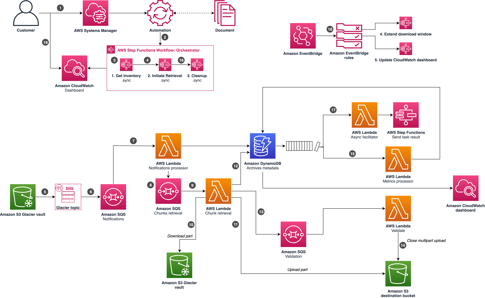

# Data Transfer from Amazon S3 Glacier vaults to Amazon S3

The Data Transfer from Amazon S3 Glacier vaults to Amazon S3 is a serverless solution that automatically copies entire Amazon S3 Glacier vault archives to a defined destination Amazon Simple Storage Service (Amazon S3 bucket) and S3 storage class.

The solution automates the optimized restore, copy, and transfer process and provides a prebuilt Amazon CloudWatch dashboard to visualize the copy operation progress. Deploying this solution allows you to seamlessly copy your S3 Glacier vault archives to more cost effective storage locations such as the Amazon S3 Glacier Deep Archive storage class.

Copying your Amazon S3 Glacier vault contents to the S3 Glacier Deep Archive storage class combines the low cost and high durability benefits of S3 Glacier Deep Archive, with the familiar Amazon S3 user and application experience that offers simple visibility and access to data. Once your archives are stored as objects in your Amazon S3 bucket, you can add tags to your data to enable items such as attributing data costs on a granular level.

_Note: The solution only copies archives from a source S3 Glacier vault to
the destination S3 bucket, it does not delete archives in the source S3 Glacier vault. After the solution completes a successful archive copy to the destination S3 bucket, you must manually delete the archives from your S3 Glacier vault.For more information,
refer to [Deleting an Archive in Amazon S3 Glacier](https://docs.aws.amazon.com/amazonglacier/latest/dev/deleting-an-archive.html) in the Amazon S3 Glacier Developer Guide._

## Table of contents

- [Architecture](#architecture)
- [Deploying the solution](#deploying-the-solution)
  - [One click deployment](#one-click-deploy-from-aws-cloudformation)
  - [Deploy from source code](#deploy-from-source-code-using-cdk)
- [Automated testing pipeline](#automated-testing-pipeline)
- [Project structure](#project-structure)
- [CDK documentation](#cdk-documentation)
- [Anonymous metric collection](#collection-of-operational-metrics)

## Architecture



1. Customers invoke a transfer workflow by using an AWS Systems Manager
   document (SSM document).
2. The SSM document starts an AWS Step Functions Orchestrator execution.
3. The Step Functions Orchestrator execution initiates a nested Step Functions Get Inventory workflow to retrieve the inventory file.
4. Upon completion of the inventory retrieval, the solution invokes the Initiate Retrieval nested Step Functions workflow.
5. When a job is ready, Amazon S3 Glacier sends a notification to an Amazon SNS topic indicating job completion.
6. The solution stores all job completion notifications in the Amazon SQS Notifications queue.
7. When an archive job is ready, Amazon SQS Notifications queue invokes the AWS LambdaNotifications Processor function. This Lambda function prepares the initial steps for archive retrieval.
8. The Lambda Notifications Processor function places chunks retrieval messages in Amazon SQS Chunks Retrieval queue for chunk processing.
9. The Amazon SQS Chunks Retrieval queue invokes the Lambda Chunk Retrieval function to process each chunk.
10. The Lambda Chunk Retrieval function downloads the chunk from Amazon S3 Glacier.
11. The Lambda Chunk Retrieval function uploads a multipart upload part to Amazon S3.
12. After a new chunk is downloaded, the solution stores chunk metadata Amazon DynamoDB (etag, checksum_sha_256, tree_checksum)
13. The Lambda Chunk Retrieval function verifies whether all chunks for that archive have been processed. If yes, it inserts an event into the Amazon SQS Validation queue to invoke the Lambda Validate function.
14. The Lambda Validate function performs an integrity check and then closes the Amazon S3 multipart upload.
15. A DynamoDB stream invokes the Lambda Metrics Processor to update the transfer process metrics in DynamoDB.
16. The Step Functions Orchestrator execution enters an async wait, pausing until the archive retrieval workflow concludes before initiating the Step Functions Cleanup workflow.
17. The DynamoDB stream invokes the Lambda Async Facilitator function, which unlocks asynchronous waits in Step Functions.
18. The Amazon EventBridge rules periodically initiate Step Functions Extend Download Window and Update CloudWatch Dashboard workflows.
19. Customers monitor the transfer progress by using the Amazon CloudWatch dashboard.

## Deploying the solution

### One-Click deploy From AWS CloudFormation

Refer to the [solution landing page](https://aws.amazon.com/solutions/implementations/data-transfer-from-amazon-s3-glacier-vaults-to-amazon-s3) to deploy the solution using our pre-packaged deployment assets.

### Deploy from source code using CDK

The solution can be deployed to your AWS account directly from the source code using AWS Cloud Development Kit (CDK).

#### Prerequisites

Install prerequisite software packages:

- [AWS Command Line Interface](https://aws.amazon.com/cli/)
- [Nodejs](https://nodejs.org/en/download)
- [Python](https://www.python.org/)
- [pyenv](https://github.com/pyenv/pyenv)
- [pyenv-virtualenv](https://github.com/pyenv/pyenv-virtualenv)

_note: following instructions tested with nodejs v20.10.0 and python 3.11.6_

#### 1. Download or clone this repo

```
git clone https://github.com/aws-solutions/data-transfer-from-amazon-s3-glacier-vaults-to-amazon-s3
```

#### 2. Create and start virtual environment

```
pyenv virtualenv 3.11.0 grf-venv
pyenv activate grf-venv
```

#### 3. Install the application

```
pip install ".[dev]"
```

#### 4. Deploy the solution using CDK

Make sure AWS CLI is operational ([see here](https://docs.aws.amazon.com/cli/latest/userguide/cli-chap-configure.html))

```
aws s3 ls
```

Bootstrap CDK, if required

```
npx cdk bootstrap
```

Deploy the solution

```
npx cdk deploy solution -c skip_integration_tests=true
```

_note: set context parameter `skip_integration_tests=false` to indicate if you want to run integration tests against the solution stack_

#### 5. Running integration tests

```
npx cdk deploy mock-glacier
export MOCK_SNS_STACK_NAME=mock-glacier # use mock-glacier stack name
export $STACK_NAME=solution # use solution stack name
tox -e integration
```

## Automated testing pipeline

The Data Transfer from S3 Glacier vaults to S3 includes an optional automated testing pipeline that can be deployed to automatically test any
changes you develop for the solution on your own development fork. Once setup, this pipeline will automatically
download, build, and test any changes that you push to a specified branch on your development fork.

The pipeline can be configured to automatically watch and pull from repos hosted on [AWS CodeCommit](https://aws.amazon.com/codecommit/)

- [Creating and connecting to codecommit repository](https://docs.aws.amazon.com/codecommit/latest/userguide/how-to-create-repository.html)
- Push this source code to the codecommit repository
- Create the pipeline

```
npx cdk deploy pipeline -c repository_name=my-repo -c branch=dev
```

The pipeline will be triggered any time you make a push to the codecommit repository on the identified branch.

_note: due to a known issue where resource name gets truncated, we recommend branch name no longer than 3 characters, while the fix is being worked on._

## Project structure

```
├── source
│   ├── solution            [Source code]
│   │   ├── application      [Lambda microservices code]
│   │   ├── infrastructure   [CDK code to provision infrastructure related cdk]
│   │   ├── mocking          [CDK code to create mock glacier stack]
│   │   ├── pipeline         [CDK code to deploy developer friendly pipeline]
│   └── tests                [Unit and integration tests]
├── tox.ini                  [Tox configuration file]
├── pyproject.toml           [Project configuration file]
```

## CDK Documentation

Data Transfer from Amazon S3 Glacier vaults to Amazon S3 templates are
generated using AWS CDK, for further information on CDK please refer to the
[documentation](https://docs.aws.amazon.com/cdk/latest/guide/getting_started.html).

## Collection of operational Metrics

This solution collects anonymous operational metrics to help AWS improve the quality and features of the solution. For more information, including how to disable this capability, please see the [implementation guide](https://docs.aws.amazon.com/solutions/latest/instance-scheduler-on-aws/anonymized-data.html).

---

Copyright Amazon.com, Inc. or its affiliates. All Rights Reserved.

Licensed under the Apache License Version 2.0 (the "License"). You may not use this file except in compliance with the
License. A copy of the License is located at

    http://www.apache.org/licenses/

or in the "[LICENSE](./LICENSE)" file accompanying this file. This file is distributed on an "AS IS" BASIS, WITHOUT
WARRANTIES OR CONDITIONS OF ANY KIND, express or implied. See the License for the specific language governing
permissions and limitations under the License.
