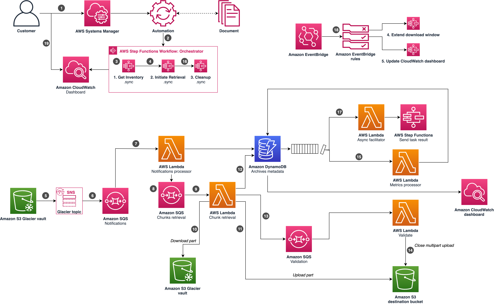

# Data transfer from Amazon S3 Glacier vaults to Amazon S3 (v1.1.4)

Data transfer from Amazon S3 Glacier vaults to Amazon S3 is a serverless Guidance that automatically copies entire Amazon S3 Glacier vault archives to a defined destination Amazon Simple Storage Service (Amazon S3 bucket) and S3 storage class.

The Guidance automates the optimized restore, copy, and transfer process and provides a prebuilt Amazon CloudWatch dashboard to visualize the copy operation progress. Deploying this Guidance allows you to seamlessly copy your S3 Glacier vault archives to more cost effective storage locations such as the Amazon S3 Glacier Deep Archive storage class.

Copying your Amazon S3 Glacier vault contents to the S3 Glacier Deep Archive storage class combines the low cost and high durability benefits of S3 Glacier Deep Archive, with the familiar Amazon S3 user and application experience that offers simple visibility and access to data. Once your archives are stored as objects in your Amazon S3 bucket, you can add tags to your data to enable items such as attributing data costs on a granular level.

 _Note: The Guidance only copies archives from a source S3 Glacier vault to
 the destination S3 bucket, it does not delete archives in the source S3 Glacier vault. After the Guidance completes a successful archive copy to the destination S3 bucket, you must manually delete the archives from your S3 Glacier vault. For more information,
 refer to [Deleting an Archive in Amazon S3 Glacier](https://docs.aws.amazon.com/amazonglacier/latest/dev/deleting-an-archive.html) in the Amazon S3 Glacier Developer Guide._

## Architecture



1.	Invoke a transfer workflow using an AWS Systems Manager document. 
2.	The Systems Manager document starts an AWS Step Functions Orchestrator execution.
3.	The Step Functions Orchestrator execution initiates a nested Step Functions Get Inventory workflow to retrieve the inventory file.
4.	Upon completion of the inventory retrieval, the Guidance invokes the Initiate Retrieval nested Step Functions workflow.
5.	When a job is ready, Amazon Simple Storage Service (Amazon S3) Glacier sends a notification to an Amazon Simple Notification Service (Amazon SNS) topic, indicating job completion.
6.	The Guidance stores all job completion notifications in the Amazon Simple Queue Service (Amazon SQS) Notifications queue.
7.	When an archive job is ready, the Amazon SQS Notifications queue invokes the AWS Lambda Notifications Processor function. This Lambda function prepares the initial steps for archive retrieval.
8.	The Lambda Notifications Processor function places chunks retrieval messages in Amazon SQS Chunks Retrieval queue for chunk processing.
9.	The Amazon SQS Chunks Retrieval queue invokes the Lambda Chunk Retrieval function to process each chunk.
10.	The Lambda Chunk Retrieval function downloads the chunk from Amazon S3 Glacier.
11.	The Lambda Chunk Retrieval function uploads a multipart upload part to Amazon Simple Storage Service (Amazon S3).
12.	After a new chunk is downloaded, the Guidance stores chunk metadata in Amazon DynamoDB (for example, etag, checksum_sha_256, tree_checksum).
13.	The Lambda Chunk Retrieval function verifies whether all chunks for that archive have been processed. If so, it inserts an event into the Amazon SQS Validation queue to invoke the Lambda Validate function.
14.	The Lambda Validate function performs an integrity check against the tree hash in the inventory, calculates a checksum, and passes it to the into the close multipart upload call. If that hash is wrong, Amazon S3 rejects the request.
15.	DynamoDB Streams invokes the Lambda Metrics Processor function to update the transfer process metrics in DynamoDB.
16.	The Step Functions Orchestrator execution enters an async wait, pausing until the archive retrieval workflow concludes before initiating the Step Functions Cleanup workflow.
17.	The DynamoDB stream invokes the Lambda Async Facilitator function, which unlocks asynchronous waits in Step Functions.
18.	Amazon EventBridge rules periodically initiate Step Functions Extend Download Window and Update Amazon CloudWatch Dashboard workflows.
19.	Monitor the transfer progress using a CloudWatch dashboard.

Refer to the [developer guide](./docs/DEVELOPER_GUIDE.md) for more details about the internal components, workflows, and resource dependencies involved in transferring a Glacier Vault to S3.

## Cost

You are responsible for the cost of the AWS services used while running this Guidance. As of this revision, the cost for running this Guidance with the default settings in the US East (Ohio) Region is approximately $153.57 for 100,000 S3 Glacier vault archives (1GB each) and $1,229.21 for 10,000,000 S3 Glacier vault archives (10MB each). These costs assume that the destination bucket is also in US East (Ohio) Region. Refer to Sample cost tables for more details.

_note: If the destination bucket is not in the same region as the Glacier vault, a "Data Transfer OUT From Amazon S3 Glacier" fee will be added. See Data transfer pricing for more information. This cost should be considered when planning your data storage and transfer strategies to avoid unexpected charges.

See the pricing webpage for each AWS service used in this Guidance. Estimated costs vary based on the number of archives processed and the total volume of data to copy from an S3 Glacier vault.
We recommend creating a budget through AWS Cost Explorer to help manage costs. Prices are subject to change. For full details, see the pricing webpage for each AWS service used in this Guidance.

_note: Costs associated with storing data in the Amazon S3 service are nearly continuous and aren't included in these estimates.

The following tables provide two sample cost breakdowns for deploying this Guidance with the default parameters in the US East (Ohio) Region, with an S3 Glacier vault size of 100 TB. These cost breakdowns are based on the destination bucket is also being in the US East (Ohio) Region, the same region as the S3 Glacier vault.

Example: 100,000 S3 Glacier vault archives

| AWS service  | Dimensions | Cost [USD] |
| ----------- | ------------ | ------------ |
| Step Functions | |	$0.07 |
| Lambda	| |	$140.00 |
| DynamoDB | |	$2.00 |
| Amazon S3 |	Transfer cost |	$5.00 |
| Additional services: Amazon SQS, Amazon SNS, AWS Glue, CloudWatch	| |	$6.50 |
|	| Total:	| $153.57 [USD] |


## Deploying the Guidance

### Deploy from source code using CDK

The Guidance can be deployed to your AWS account directly from the source code using AWS Cloud Development Kit (CDK).

#### Prerequisites

- AWS CLI configured with appropriate credentials
- CDK bootstrapped in your AWS account: `npx cdk bootstrap`
- Destination S3 bucket created before deployment
- Python virtual environment activated

Install prerequisite software packages:

- [AWS Command Line Interface](https://aws.amazon.com/cli/)
- [Nodejs](https://nodejs.org/en/download)
- [Python](https://www.python.org/)
- [pyenv](https://github.com/pyenv/pyenv)
- [pyenv-virtualenv](https://github.com/pyenv/pyenv-virtualenv)

_note: following instructions tested with nodejs v20.10.0 and python 3.11.6_

#### 1. Download or clone this repo

```
git clone https://github.com/aws-solutions-library-samples/data-transfer-from-amazon-s3-glacier-vaults-to-amazon-s3.git
```

#### 2. Create and start virtual environment

```
pyenv virtualenv 3.11.0 grf-venv
pyenv activate grf-venv
```

#### 3. Install the application

```
pip install ".[dev]"
```

#### 4. Deploy the Guidance using CDK

Make sure AWS CLI is operational ([see here](https://docs.aws.amazon.com/cli/latest/userguide/cli-chap-configure.html)).

Before deploying the stack, it is necessary to create a destination S3 bucket where the archives will be transferred. 
The name of this bucket should be specified via a CloudFormation parameter *DestinationBucketParameter*.


```
aws s3 ls
```

Bootstrap CDK, if required (this creates a CloudFormation stack called CDKToolkit, resources needed to deploy AWS  CDK apps into an environment)

```
npx cdk bootstrap
```

    Optional:  To get your CDK bootstrap bucket
    
    aws cloudformation describe-stacks --stack-name CDKToolkit --query "Stacks[0].Outputs[?OutputKey=='BucketName'].OutputValue" --output text`


<details>
<summary><strong>Same-account deployment</strong> — Glacier vault and S3 bucket are in the same AWS account</summary>

Deploy the Guidance. Make sure "solution" is your project name, i.e. "data-transfer-from-amazon-s3-glacier-vaults-to-amazon-s3", and DestinationBucketParameter is your newly created bucket.

    npx cdk deploy solution --parameters DestinationBucketParameter=my-output-bucket-name

Once deployed, initiate the transfer using the Systems Manager Launch document.

</details>

<details>
<summary><strong>Cross-account deployment</strong> — Glacier vault is in a different AWS account than the destination S3 bucket</summary>

The Guidance supports migrating archives from a Glacier vault in a different AWS account. Deploy the solution in the same account as the destination S3 bucket and provide the source vault's account ID as a CloudFormation parameter during deployment.

##### 1. Set a vault access policy on the source vault

In the account that owns the Glacier vault, set a vault access policy to allow the destination account to access it:

    aws glacier set-vault-access-policy \
      --account-id <SOURCE_ACCOUNT_ID> \
      --vault-name <VAULT_NAME> \
      --policy 'Policy="{\"Version\":\"2012-10-17\",\"Statement\":[{\"Effect\":\"Allow\",\"Principal\":{\"AWS\":\"arn:aws:iam::<DESTINATION_ACCOUNT_ID>:root\"},\"Action\":[\"glacier:InitiateJob\",\"glacier:GetJobOutput\"],\"Resource\":\"arn:aws:glacier:<REGION>:<SOURCE_ACCOUNT_ID>:vaults/<VAULT_NAME>\"}]}"'

Replace `<DESTINATION_ACCOUNT_ID>`, `<SOURCE_ACCOUNT_ID>`, `<REGION>`, and `<VAULT_NAME>` with your values. This command must be run by a principal in the source vault account with `glacier:SetVaultAccessPolicy` permission.

NOTE: The vault access policy is additive — it grants cross-account access without affecting existing access from within the source account.

##### 2. Deploy the solution with the source vault account ID

Make sure "solution" is your project name, i.e. "data-transfer-from-amazon-s3-glacier-vaults-to-amazon-s3". Pass the `SourceVaultAccountIdParameter` and `DestinationBucketParameter` during deployment:

    npx cdk deploy solution \
      --parameters DestinationBucketParameter=my-output-bucket-name \
      --parameters SourceVaultAccountIdParameter=123456789012

Replace `123456789012` with the 12-digit AWS account ID that owns the source Glacier vault.

Replace `my-output-bucket-name' with the name of the destination S3 bucket.

When `SourceVaultAccountIdParameter` is left empty (the default), the solution behaves identically to a same-account transfer.

##### 3. Run the transfer

Once both the vault policy and deployment are in place, initiate the transfer using the Systems Manager Launch document. The vault name refers to the vault in the source account.

</details>

NOTE: set context parameter `skip_integration_tests` to `false` to indicate if you want to run integration tests against the solution stack: `npx cdk deploy solution -c skip_integration_tests=false --parameters DestinationBucketParameter=my-output-bucket-name`._

Deployment Issues(try this)

    If there are issues during the deploy steps, it may need a cdk synth step

    Synthesize CDK template
    Make sure "solution" is your project name, i.e. 
    
    "data-transfer-from-amazon-s3-glacier-vaults-to-amazon-s3", and DestinationBucketParameter are your newly created bucket, sample "s3glacier-copies-test"

    npx cdk synth solution --parameters DestinationBucketParameter=s3glacier-copies-test


#### 5. Running integration tests
```
export MOCK_SNS_STACK_NAME=mock-glacier # use mock-glacier stack name
export STACK_NAME=solution # use solution stack name

or

$env:MOCK_SNS_STACK_NAME="mock-glacier"
$env:STACK_NAME="data-transfer-from-amazon-s3-glacier-vaults-to-amazon-s3"

npx cdk deploy mock-glacier
tox -e integration
```

## Automated testing pipeline

The Data transfer from S3 Glacier vaults to S3 includes an optional automated testing pipeline that can be deployed to automatically test any
changes you develop for the Guidance on your own development fork. Once setup, this pipeline will automatically
download, build, and test any changes that you push to a specified branch on your development fork.

The pipeline can be configured to automatically watch and pull from repos hosted on [AWS CodeCommit](https://aws.amazon.com/codecommit/)

- [Creating and connecting to codecommit repository](https://docs.aws.amazon.com/codecommit/latest/userguide/how-to-create-repository.html)
- Push this source code to the codecommit repository
- Create the pipeline

```
npx cdk deploy pipeline -c repository_name=my-repo -c branch=dev -c skip_integration_tests=false -c output_bucket_name=my-output-bucket-name
```

The pipeline will be triggered any time you make a push to the codecommit repository on the identified branch.

NOTE: due to a known issue where resource name gets truncated, we recommend branch name no longer than 30 characters.

## Project structure

```
├── source
│   ├── solution            [Source code]
│   │   ├── application      [Lambda microservices code]
│   │   ├── infrastructure   [CDK code to provision infrastructure related cdk]
│   │   ├── mocking          [CDK code to create mock glacier stack]
│   │   ├── pipeline         [CDK code to deploy developer friendly pipeline]
│   └── tests                [Unit and integration tests]
├── tox.ini                  [Tox configuration file]
├── pyproject.toml           [Project configuration file]
```

## CDK Documentation

Data transfer from Amazon S3 Glacier vaults to Amazon S3 templates are
generated using AWS CDK, for further information on CDK please refer to the
[documentation](https://docs.aws.amazon.com/cdk/latest/guide/getting_started.html).

## Collection of operational Metrics

This Guidance collects anonymous operational metrics to help AWS improve the quality and features of the Guidance. For more information, including how to disable this capability, please see the [implementation guide](https://docs.aws.amazon.com/solutions/latest/instance-scheduler-on-aws/anonymized-data.html).

## Uninstall the Guidance

You can uninstall the Data transfer from Amazon S3 Glacier Vaults to Amazon S3 Guidance from the AWS Management Console or by using the AWS Command Line Interface. Manually delete the following resources:
•	S3 buckets (other than the output bucket if you intend to keep the transferred archives)
•	DynamoDB tables
•	CloudWatch Logs

### Using AWS Management Console

1.	Sign in to the CloudFormation console.
2.	On the Stacks page, select this guidance's installation stack.
3.	Choose Delete.

### Using AWS Command Line Interface

Determine whether the AWS Command Line Interface (AWS CLI) is available in your environment. For installation instructions, see What Is the AWS Command Line Interface in the AWS CLI User Guide. After confirming that the AWS CLI is available, run the following command.


    $ aws cloudformation delete-stack --stack-name <installation-stack-name>

    or example

    $ aws cloudformation delete-stack --stack-name  data-transfer-from-amazon-s3-glacier-vaults-to-amazon-s3


### Deleting the S3 buckets

This Guidance is configured to retain the guidance-created S3 buckets if you decide to delete the CloudFormation stack, to prevent accidental data loss. After uninstalling the Guidance, you can manually delete the S3 buckets if you don't need to retain the data. Follow these steps to delete the S3 buckets.

1.	Sign in to the Amazon S3 console.
2.	Choose Buckets from the left navigation pane.
3.	Locate the <stack-name> S3 buckets.
4.	Select each S3 bucket and choose Empty.
5.	Select each S3 bucket and choose Delete.

#### For an automated removal of the s3 buckets in the stack, it is your responsibility to confirm the buckets are not required to keep and to correct stack name is used

    List all S3 buckets for the stack (example deployment name: data-transfer-from-amazon-s3-glacier-vaults-to-amazon-s3)

    aws s3 ls | findstr "data-transfer-from-amazon-s3-glacier-vaults-to-amazon-s3"


Empty each bucket (replace BUCKET-NAME with actual bucket names from list above)

    aws s3 rm s3://data-transfer-from-amazon-s3-glacier-vaults-to-amazon-s3-inventorybucket-XXXXX --recursive


    aws s3 rm s3://data-transfer-from-amazon-s3-glacier-vaults-to-amazon-s3-bucketaccesslogs-XXXXX --recursive


#### Delete each bucket after emptying

    aws s3 rb s3://data-transfer-from-amazon-s3-glacier-vaults-to-amazon-s3-inventorybucket-XXXXX

    aws s3 rb s3://data-transfer-from-amazon-s3-glacier-vaults-to-amazon-s3-bucketaccesslogs-XXXXX

### Deleting the DynamoDB tables

This Guidance is configured to retain the guidance-created DynamoDB tables if you decide to delete the CloudFormation stack, to prevent accidental data loss.
1.	Sign in to the DynamoDB console.
2.	Choose Tables from the left navigation pane.
3.	Locate the <stack-name> DynamoDB tables.
4.	Select each DynamoDB table and choose Delete.
5.	Confirm the deletion.


If your comfortable removing all tables for the deployed solution, cli commands are noted:

    List all DynamoDB tables for the solution

    aws dynamodb list-tables --query "TableNames[?contains(@, 'solution')]" --output table

    or

    an example if using "data-transfer-from-amazon-s3-glacier-vaults-to-amazon-s3" as your deployed name

    aws dynamodb list-tables --query "TableNames[?contains(@, 'data-transfer-from-amazon-s3-glacier-vaults-to-amazon-s3')]" --output table

    then remove all dynamodb tables matching the stack name (powershell)

    aws dynamodb list-tables --query "TableNames[?contains(@, 'data-transfer-from-amazon-s3-glacier-vaults-to-amazon-s3')]" --output text | ForEach-Object { aws dynamodb delete-table --table-name $_ }


### Deleting the CloudWatch logs
For an automated removal of the CloudWatch logs in the stack, it is your responsibility to confirm the logs are not required to keep and to correct stack name is used

List all CloudWatch Log Groups for the stack

    aws logs describe-log-groups --query "logGroups[?contains(logGroupName, 'solution')].logGroupName" --output table

    or
    an example if using "data-transfer-from-amazon-s3-glacier-vaults-to-amazon-s3" as your deployed name

    aws logs describe-log-groups --query "logGroups[?contains(logGroupName, 'data-transfer-from-amazon-s3-glacier-vaults-to-amazon-s3')].logGroupName" --output table


Delete specific log groups (replace with actual names from list above)

    aws logs delete-log-group --log-group-name /aws/lambda/solution-vaults-to-amazon-s3-XXXXX

    or an example

    aws logs delete-log-group --log-group-name /aws/lambda/data-transfer-from-amazon-s3-glacier-vaults-to-amazon-s3-XXXXX


Delete other CloudWatch logs
    aws logs delete-log-group --log-group-name /aws/vendedlogs/states/solution-XXXXX

    or an example

    aws logs delete-log-group --log-group-name /aws/vendedlogs/states/  data-transfer-from-amazon-s3-glacier-vaults-to-amazon-s3-XXXXX


Copyright Amazon.com, Inc. or its affiliates. All Rights Reserved.

Licensed under the Apache License Version 2.0 (the "License"). You may not use this file except in compliance with the
License. A copy of the License is located at

http://www.apache.org/licenses/

or in the "[LICENSE](./LICENSE)" file accompanying this file. This file is distributed on an "AS IS" BASIS, WITHOUT
WARRANTIES OR CONDITIONS OF ANY KIND, express or implied. See the License for the specific language governing
permissions and limitations under the License.
