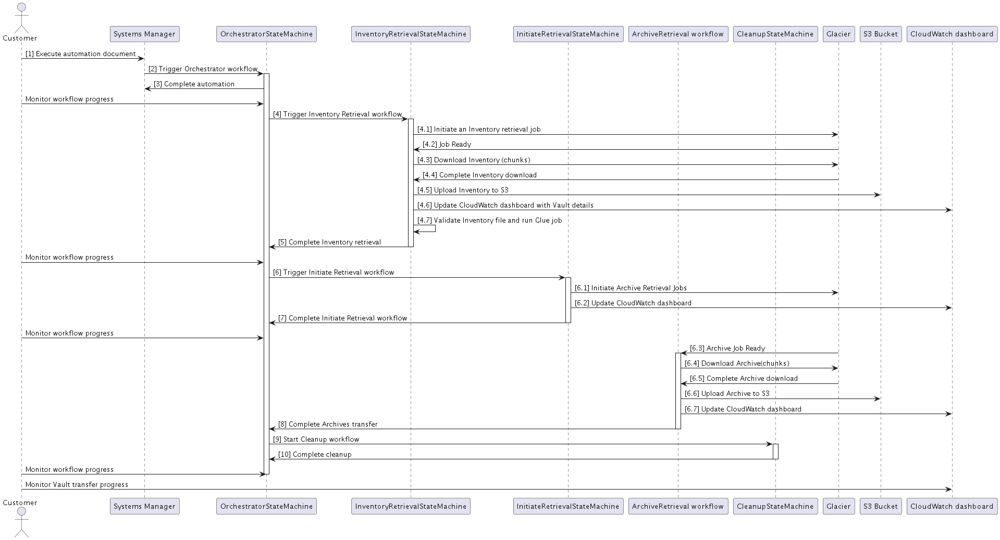

# Data Transfer from Amazon S3 Glacier Vaults to Amazon S3 - Developer Guide
## Transfer Workflow Sequence Diagram

The sequence diagram below illustrates the sequence of events, starting with the customer's interaction with Systems Manager through executing an automation document to launch a transfer. It demonstrates the internal components, workflows, and resource dependencies involved in transferring a Glacier Vault to S3.

## How the Solution works?

*Data Transfer from Amazon S3 Glacier Vaults to Amazon S3* Solution leverages *Systems Manager* automation documents as entry points, providing a user-friendly interface for initiating transfer workflows. After deploying the Solution, two automation documents are created to capture all necessary inputs from users; `LaunchAutomationRunbook` and `ResumeAutomationRunbook`.

* `LaunchAutomationRunbook` initiates a new orchestrator workflow to transfer archives from a Glacier vault to an S3 bucket.
* `ResumeAutomationRunbook` initiates an orchestrator workflow to resume a partially completed transfer from a Glacier vault to an S3 bucket. This can happen due to failures during the initial transfer or intentional stops by the customer.

 

### Orchestrator workflow

Once users provide the necessary inputs and execute the automation document, the main orchestrator Step Function `OrchestratorStateMachine` is triggered. This orchestrator Step Function consists of a series of steps, designed to manage the entire transfer process:

1. Metadata regarding the entire transfer is stored in `GlacierObjectRetrieval` DynamoDB table.
2. A nested Step Function `ArchivesStatusCleanupStateMachine` is triggered to clean up any outdated archives statuses in DynamoDB resulting from partial transfer or previously failed transfers.
3. Following this, a nested Step Function `InventoryRetrievalStateMachine` is triggered to retrieve the *Inventory* file. Refer [Vault Inventory](https://docs.aws.amazon.com/amazonglacier/latest/dev/vault-inventory.html).
4. Upon completing the *Inventory* file download, two *EventBridge* rules are configured to periodically trigger nested Step Functions `ExtendDownloadWindowStateMachine` and `CloudWatchDashboardUpdateStateMachine`.
5. Subsequently, a nested Step Function `InitiateRetrievalStateMachine` is triggered which iterates through the archives records listed in the downloaded *Inventory* file and initiates retrieval job for each archive.
6. Afterward, another *EventBridge* rule is configured to periodically trigger `CompletionChecker` Lambda function which checks the completion of the `ArchiveRetrieval` workflow.
7. Subsequently, the workflow enters an asynchronous wait, pausing until the `ArchiveRetrieval` workflow concludes before the nested `CleanupStateMachine` Step Function is triggered.

### Inventory Retrieval workflow

`InventoryRetrievalStateMachine` Step Function’s purpose is to retrieve the *Inventory* file of a specific Vault, which is then used in subsequent steps to transfer the included archives records. 
`InventoryRetrievalStateMachine` Step Function consists of a series of steps, designed to manage the retrieval and downloading of the *Inventory* file:

1. `InventoryRetrievalStateMachine` Step Function has the option (choice step) to bypass the *Inventory* download step if the *Inventory* is already provided by the user.
2. `RetrieveInventoryInitiateJob` Lambda is invoked to Initiate an *Inventory* retrieval job.
3. Subsequently, the workflow enters an asynchronous wait, pausing until the *Inventory* retrieval job is completed and ready for downloading.
4. Upon Glacier sending a job completion event to `AsyncFacilitatorTopic` SNS topic, which is configured to deliver messages to `NotificationsQueue` SQS queue, which in turn triggers `AsyncFacilitator` Lambda function to unlock the asynchronous wait, allowing the workflow to proceed with the *Inventory* download.
5. `InventoryChunkDownload` Lambda function is invoked within a Distributed map, with each iteration downloading a chunk of the *Inventory* file.
6. Following the completion of downloading all chunks, the `InventoryValidation` Lambda function validates the downloaded *Inventory* file and stores it in the `InventoryBucket` S3 bucket under *original_inventory* prefix.
7. After that, a Glue job is generated based on a predefined glue workflow graph definition.
8. The Glue job filters out archives greater than 5 TB, then sorts the remaining archives by creation date, performs description parsing to extract archive names, handles duplicates, and partitions the *Inventory* into predefined partitions stored in the `InventoryBucket` S3 bucket under the *sorted_inventory* prefix.
9. After that, `SendAnonymizedStats` Lambda function is invoked to send anonymized operational metrics

### Initiate Archives Retrieval workflow

`InitiateRetrievalStateMachine` Step Function’s purpose is to initiate retrieval job for all the archives listed in the *Inventory* file. A Distributed map with a locked concurrency is used to iterate over the ordered inventory stored in S3. `InitiateArchiveRetrieval` Lambda function is invoked to process batches of 100 archives. `InitiateRetrievalStateMachine` processes a portion of the archives included in the *Inventory* file at a time to control the request rate. It then calculates a timeout value based on the size of the processed portion and the time taken to initiate retrieval jobs. This ensures that the total number of initiated archive jobs within a 24-hour period remains below Glacier's daily quota.

1. For each partition, DynamoDB partition metadata is reset, which will be used to capture the total requested archives jobs within the partition and the time taken for jobs initiation.
2. Following this, two nested Distributed maps are utilized, the outer one iterates through S3 CSV partition files located in the `InventoryBucket` S3 bucket under the *sorted_inventory* prefix, while the inner map iterates through individual archive records within each file.
3. To ensure archives are requested in order, concurrency for Distributed maps is set to 1.
4. `InitiateArchiveRetrieval` Lambda function is invoked within the inner distributed map, which is configured with a batch size of 100, enabling it to concurrently initiate 100 archives jobs and achieve nearly 100 transactions per second (TPS).
5. Upon completing the requests for all archives within a partition, `CalculateTimeout` Lambda is invoked to calculate the wait time before initiating requests for the next partition.
6. The timeout value is calculated based on partition size, Glacier daily quota, and the time elapsed to initiate requests.

### Archive Retrieval workflow

Archives Retrieval follows an event-driven architecture:

1. When a job is ready, Glacier sends a notification to the `AsyncFacilitatorTopic` SNS topic. This SNS topic is set up to deliver messages to `NotificationsQueue` SQS queue, indicating the completion of the job.
2. `NotificationsQueue` SQS queue triggers `NotificationsProcessor` Lambda function, responsible for processing notifications and initiating initial steps for archive retrieval. This includes starting a multipart upload and calculating the number and sizes of chunks.
3. Then `NotificationsProcessor` Lambda function places messages for chunk retrieval in `ChunksRetrievalQueue` SQS queue for further processing.
4. `ChunksRetrievalQueue` SQS queue triggers `ChunkRetrieval` Lambda function to retrieve archive’s chunk.
    1. First, `ChunkRetrieval` Lambda function downloads the chunk from Glacier.
    2. Then, it uploads a multipart upload part to S3 destination bucket.
    3. After a new chunk is download, chunk metadata are stored in `GlacierObjectRetrieval` DynamoDB table.
    4. `ChunkRetrieval` Lambda function verifies whether all chunks for a particular archive have been processed. If so, it inserts an event into `ValidationQueueSQS` queue to trigger `ArchiveValidationLambda` function.
5. `ArchiveValidation` Lambda function conducts hash validation and integrity checks before closing the S3 multipart upload.
6. `MetricTable` DynamoDB stream invokes `MetricsProcessor` Lambda function to update transfer process metrics in `MetricTable` DynamoDB table.

 
### Archives Status Cleanup workflow

`ArchivesStatusCleanupStateMachine` Step Function’s purpose is to update any outdated archive statuses in DynamoDB to a terminated status, especially when resuming a partial transfer or a previously failed transfer attempt. `ArchivesStatusCleanupStateMachine` Step Function is triggered prior to initiating a transfer workflow.

### Download Window extension workflow

`ExtendDownloadWindowStateMachine` Step Function’s purpose is to account for the 24hr download window for each archive. At predefined intervals, archives that are staged will be checked to see how long is left in their download window. If the remaining time is less than five hours, another retrieval job is initiated (No additional cost to re-stage already staged archives). 
 
`ExtendDownloadWindowStateMachine` Step Function consists of a series of steps, designed to manage the extension process for the download window of staged archives nearing expiration:

1. First `ArchivesNeedingWindowExtension` Lambda function is invoked to query DynamoDB, capturing all archives  already staged but set to expire within the next 5 hours.
2. Then this lambda generates an S3 JSON file containing these archives needing a download window extension, and write this file to the inventory bucket.
3. Then, a Distributed map iterates over the generated JSON file, and batch process these archives.
4. Within this Distributed map, `ExtendDownloadInitiateRetrieval` Lambda function is invoked to batch initiate requests for the archives which are included in the generated JSON file

### CloudWatch Dashboard Update workflow

`CloudWatchDashboardUpdateStateMachine` Step Function’s purpose is to update the Solution’s custom CloudWatch dashboard `CloudWatchDashboard` every 5 minutes, refreshing the dashboard with the recently collected metrics.
 
`CloudWatchDashboardUpdateStateMachine` Step Function consists of a series of steps, designed to refresh the dashboard with the recently collected metrics:

1. Begin by querying `MetricTable` DynamoDB table
2. Subsequently, call *PutMetricData* API to update CloudWatch dashboard

### Completion Checker workflow

`CompletionChecker` Lambda function’s purpose is to periodically verify the completion status of the `ArchiveRetrieval` workflow. It accomplishes this by checking the `MetricTable` DynamoDB table to compare the count of downloaded archives with the total number of archives originally in the Vault. When the counts are equal, it concludes the asynchronous wait and proceeds to the `CleanupStateMachine` Step Function.

### Cleanup workflow

`CleanupStateMachine` Step Function’s purpose is to perform post-transfer cleanup tasks. This includes removing all incomplete multipart uploads and stopping all *EventBridge* rules to prevent periodic workflows from being triggered after the transfer’s termination.
